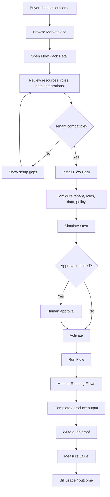
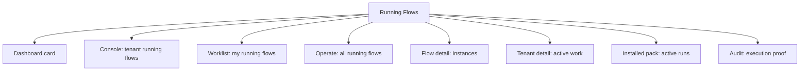
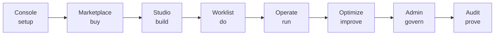

# Canonical Work OS Flow Order Diagram

## Product Shell Order

```mermaid
flowchart LR
  Website[Website: sell] --> Docs[Docs: teach]
  Docs --> Auth[Auth: enter]
  Auth --> Console[Console: setup]
  Console --> Marketplace[Marketplace: buy flows]
  Marketplace --> Studio[Studio: build and customize]
  Studio --> Worklist[Worklist: do work]
  Worklist --> Operate[Operate: run and monitor]
  Operate --> Optimize[Optimize: improve]
  Optimize --> Admin[Admin: govern]
  Admin --> Audit[Audit: prove]
  Audit --> Billing[Billing: charge]
  Billing --> Settings[Settings: configure]
```



## Core Flow Lifecycle

```mermaid
flowchart LR
  Blueprint[Blueprint] --> Pack[Flow Pack]
  Pack --> Install[Install]
  Install --> Configure[Configure]
  Configure --> Simulate[Simulate]
  Simulate --> Approve[Approve]
  Approve --> Activate[Activate]
  Activate --> Running[Running Flow]
  Running --> Instance[Flow Instance]
  Instance --> Task[Task / Decision / Agent Step]
  Task --> Output[Output]
  Output --> Audit[Audit]
  Audit --> Optimize[Optimize]
```



## Flow Commerce Lifecycle



## Running Flows Visibility



## Suite Responsibility Map



## Flow Product Rule

```text
People buy Flow Packs.
Admins install Flow Packs.
Builders configure Flow Packs.
Users execute Flow Runs.
Operators monitor Running Flows.
Executives optimize Flow Value.
Auditors prove Flow Execution.
Billing charges Flow Usage and Outcomes.
```
